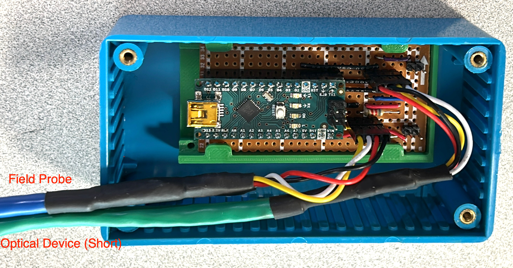

# (Semi) Automated Magnetic Field and Position Logger:

 * track position using optical counter (Encoder.h)
 * measure field using MLX90393 field sensor (MLX90393)
 * measure AC B field using pickup loop (not implemented yet)
 * use tracked position to trigger reading

The stock, Arduino IDE provided libraries for the Encoder and MLX90393 magnetic
field sensor both have some limitations, so I have modifed them both to better
support this application, and they are now contained in the project directory.

## General usage notes

The code on the Arduino as sent is set up for Serial communication at 115200
baud. The serial terminal in the Arduino IDE is a great first place to test and
debug things, but to my knowledge doesn't do any logging, which is very handy
for this application. I have been using a Linux based application (minicom) for
the basis of communicating with and logging the measurements

You can determine which /dev/ the arduino is assigned to on the computer by
either first checking via the Arduino IDE or looking at the dmesg logs. The
below is a sample to start minicom with a log file.

```
minicom -s --device /dev/ttyUSB0 --baudrate=115200 --capturefile=minicom_135.log
```

As for the minicom serial settings, they were set to the below (though I'm not
sure they are entirely the optimum, they do work):

```
    +-----------------------------------------------------------------------+
    | A -    Serial Device      : /dev/ttyUSB0                              |
    | B - Lockfile Location     : /var/lock                                 |
    | C -   Callin Program      :                                           |
    | D -  Callout Program      :                                           |
    | E -    Bps/Par/Bits       : 115200 8N1                                |
    | F - Hardware Flow Control : No                                        |
    | G - Software Flow Control : No                                        |
    | H -     RS485 Enable      : No                                        |
    | I -   RS485 Rts On Send   : No                                        |
    | J -  RS485 Rts After Send : No                                        |
    | K -  RS485 Rx During Tx   : No                                        |
    | L -  RS485 Terminate Bus  : No                                        |
    | M - RS485 Delay Rts Before: 0                                         |
    | N - RS485 Delay Rts After : 0                                         |
    |                                                                       |
    |    Change which setting?                                              |
    +-----------------------------------------------------------------------+
```

At start-up there is a brief prompt from the arduino to run a calibration
routine. The concept is to capture 1000 points as the sensor is rotated 360
degrees through the 3 axes. There is then a matlab routine (magcal)
[matlab magcal](https://www.mathworks.com/help/fusion/ug/magnetometer-calibration.html)
that can be used to correct for "hard" and "soft" iron offsets. For the most
precise measurements this may be useful. I haven't bothered to use this
calibration for some time.

For taking readings there are a couple of options. In the old days I manually
translated the sensor using a very basic X/Y/Z stage with rulers. Readings were
taken by typing R (Enter may have also been required depending on the terminal
settings). Blocks of measurements were then broken up by typing N for "NEWLINE".
There was no directly logged position information and instead position was
inferred from measurement number to ruler readings. It should still be possible
to take measurements this way. Given the slowness of taking measurements this
way I had the magnetic field sensor set up for minimum noise (200 ms measurement
time).

Now that the gear rack is up and running, it makes more sense to have the
Arduino automate the position and magnetic field measurement and logging, at
least in a 1-D sense. The optical encoder wheel has 16 slots read by 2 sensors
in quadrature (i.e. 64 edges detected per turn). The variable `encoderStep = 4`
defines how many edges it takes to before a new reading is triggered. In this
example, 4, would ensure that it triggers readings on the same edge (i.e.
equally spaced, 16 readings per turn, approx. 1.7 mm apart). Assuming a turn
rate of 1 turn/second, this equates to 16 readings per second, or 62.5 ms per
trigger.

The MLX90393 sensor has two variables that define the interaction between
sampling rate and noise: `osr` (OverSampling Rate) and `digFilt` (Digital
Filtering). The relationship is given in Table 19/20 and Figure 2/3. The sensor
also has two variables that affect sensitivity: `adcRes` (which 16 of the 19 ADC
bits to use) and `analogGain`.

The settings as shipped are:

 * encoderStep = 4
   * 16 readings per turn
   * approx 1.7 mm/reading
   * at 1 turn / sec, 62.5 ms for each reading
 * osr = MLX90393_OSR_0 = 0x00 = lowest OSR
 * digFilt = MLX90393_FILTER_6 = 0x06 = second most filtering
 * The above osr/digFilt lead to:
   * (conversion time of 13.36 ms +5 ms extra buffer).
   This should ensure that the reading for one location is completed before the
   next reading is triggered. Warnings will be reported if a new position
   trigger is issued before the magnetic field for the previous location is
   completed.
   * noise level is roughly 0.9 uT (XY) to 1.2 uT (Z)
 * analogGain = MLX90393_GAIN_1X = 0x07 = highest analog gain
   * note the defines (enum) here might go opposite of what you expect
 * adcRes = MLX90393_RES_16 = 0x00 = lowest 16 ADC bits
 * The above analogGain/adcRes lead to
   * sensitivity of 0.150 uT/LSB (XY) 0.242 uT/LSB (Z)
   * range of +/- 4.9 mT (XY), +/- 7.9 mT (Z) (int16)
   * The H12 gradient has and efficiency of approx 0.220 mT/m/A so on a 20A DC
   supply, and r=0.12m, so anticipate peak fields of around 500 uT.


## Recommended data acquisition approach:

Start the logging with the sensor at one end of travel:

```
minicom -s --device /dev/ttyUSB0 --baudrate=115200 --capturefile=minicom_135.log
```

A sample log is below:

```
Starting Program
Found a MLX90393 sensor
Run CalLoop? (y/n)
5..
Press R [ENTER] to take a reading, N [ENTER] for breakpoint
MeasI,posI,pos(mm),b(uT)X,Y,Z
Be 135
6005,0,0.0,-10.95,-63.00,-59.77
8543,4,1.7,-10.50,-62.85,-60.26
8668,8,3.4,-11.10,-59.55,-56.87
8806,12,5.1,-12.30,-58.20,-51.30
8928,16,6.8,-13.20,-55.50,-48.88
9040,20,8.5,-12.45,-51.45,-45.74
9160,24,10.2,-10.35,-50.70,-42.83
9285,28,11.9,-10.80,-46.95,-42.11
9371,32,13.6,-11.10,-44.25,-41.14
--- snip ---
63437,32,13.6,-10.50,-41.55,-40.41
63495,28,11.9,-11.70,-46.20,-41.38
63570,24,10.2,-12.45,-47.40,-43.56
63670,20,8.5,-11.55,-51.75,-41.62
63764,16,6.8,-12.60,-55.50,-48.64
63846,12,5.1,-12.75,-55.95,-49.85
63948,8,3.4,-12.30,-58.95,-53.24
64089,4,1.7,-11.85,-61.95,-55.90
64249,0,0.0,-9.90,-61.65,-59.53
NEWLINE
X 135 20.0 4.8 20.24 3.432
107290,0,0.0,-13.35,-55.65,-66.55
109068,4,1.7,-14.25,-55.05,-62.44
109236,8,3.4,-16.65,-52.35,-59.53
109450,12,5.1,-17.25,-51.45,-54.93
109562,16,6.8,-15.15,-49.20,-52.51
109659,20,8.5,-16.80,-45.45,-52.03
109748,24,10.2,-16.50,-41.70,-51.79
109837,28,11.9,-15.75,-38.70,-47.67
109910,32,13.6,-14.40,-37.35,-45.98
--- snip ---
```

The columns are:

 * 1: Timestamp in ms since the program started
 * 2: integer value of the trigger counter
 * 3: position in mm
 * 4/5/6: XYZ magnetic field in uT, in sensor coordinates
 ( Warning: Always confirm directions with chip datasheet and don't rely on board silkscreen! )

In this case any typing entered (except the special commands N and R) gets
echoed back and thus logged in the file (Backspaces don't work). In Each angular
position is indicated by the file name (135 deg) and the sensor is run out and
back to take readings for the background field, X Gradient, Y Gradient and Z
gradient in one file. The different blocks of data are separated by comments
entered by the user, in this case Be for Earth's field, then X Gradient with
20.0 A, 4.8 V as reported by the power supply, or 20.24 A and 3.434 V as
reported by a clamp ammeter and DMM at the gradient. Provided you stick with a
system for file naming and braking up blocks of data, a matlab script and/or
copying data into excel can be made pretty straightforward. There is some
backlash in the gear train, so I generally only used the data from a run in one
direction. I.e. crank slowly out, only analyze the data from the outward path
and crank back quickly.

## Arduino connections as Shipped to Stanford

The arduino interface shipped to stanford is based on an Arduino Nano (has
Mini-B USB port). Note the connection positions as in the picture.



Note that the pin order in the Dupont connector was changed to make the wiring
easier. I somewhat regret not going with consitancy and directional plugs
instead for a more fool-proof connection, just be careful to make sure all
connections are correct. It seems to be fairly failure-resistant, but an
incorrect connection could be damaging.

## General note on Arduino Libraries

The Arduino IDE expects to find and manage libraries in the ~/Arduino/libraries/
directory. This creates complications if I need to modified an Arduino IDE
supported library. The Arduino IDE library manager manages libraries via the
libraries/LibraryName/library.properties files. Unless the name (both filenames
and details in the library.properites) are modified the IDE library manager will
either overwrite the modified library as it gets updated or report conflicts.
For this reason, and to keep the code self contained, I have decided to keep the
necessary modified libraries local to the project directory. Libraries included
this was need to be kept in the Sketch/src/ folder.
[ref1](https://forum.arduino.cc/t/how-do-i-include-a-library-in-a-sketch-directory/1079812)
[ref2](https://arduino.github.io/arduino-cli/1.2/sketch-specification/#src-subfolder)

## General Notes

There are a few approaches to figuring out when to read back the data after a
reading is triggered. On the MLX90393 chip There is a data ready pin (INT/DRDY),
but it isn't accessible over the default 4-pin i2c connection. There is status
byte (i.e. similar to the technique I used with the MAG3110) that contains an
error bit that is off when DRDY is low, but the Adafruit library doesn't fully
take advantage of it. The library simply uses a delay based on the conversion
time to wait before reading back, and I'm sticking to that logic for now.

For manual triggering I had set OSR_3 (=0x03) and FILTER_7 (=0x07). This
results in a conversion time of 200.37 + 10 ms, and from Fig 2/3, noise around
XY 2 mGauss, Z 4mGauss (.2/.4 uT). For moderately fast cranking (~1.2m in
~60s) and fine sampling (every 4 ticks or ~1.7 mm) I was getting skipped
readings with OSR=1/DIG_FILT=7 (Tconv=50.61+10, noise = 5 to 8 mGauss or 0.5 to
0.8 uT). I.e. already at the next 1.7mm reading increment before the previous
one completed in 60 ms. Now dropping down to OSR=0/DIG_FILT=6 (Tconv=13.36+5,
noise = 9 to 12 mGauss or 0.9 to 1.2 uT). This should eliminate skipped
readings, as well as ensuring the positioning is good to within
13.36/60*1.7 = 0.4 mm but with hit to SNR.

## Quadrature Optical counter / tone wheel references:

[https://roboticsbackend.com/arduino-interrupts/](https://roboticsbackend.com/arduino-interrupts/)
[https://dronebotworkshop.com/rotary-encoders-arduino/](https://dronebotworkshop.com/rotary-encoders-arduino/])
[https://github.com/PaulStoffregen/Encoder](https://github.com/PaulStoffregen/Encoder)
[1](https://github.com/PaulStoffregen/Encoder?tab=readme-o)
[2](https://github.com/PaulStoffregen/Encoder?tab=readme-ov-file)

what the signal looks like:
____|****|____|****|____|****|____ (1) CLK
__|****|____|****|____|****|______ (2) DTs

I tried writing some of my own code, but the PaulStoffregen Encoder Library just works (mostly). It's pretty obfuscated, but I gather that was necessary due to the limitaions of the Arduino interrupts.

[Amazon Oiyagai LM393](https://www.amazon.ca/Willwin-Measuring-Comparator-Optocoupler-Arduino/dp/B0776RHKB1/ref=sr_1_4_sspa?crid=279RF6VA3NXN2&dib=eyJ2IjoiMSJ9.V00msEbKhoINFzmk3wZCGh4URUCLM4fXPAk6N7PsvJtwBUt0M2DLUC8l3gJLts1rvUwMy_xBOfk6ElQIu-rOqdWzDaYn4rgSwt_HOgff8uNvRL8rNOI1x1kegDP3CbbInH5BseK1QZFTN6ud9a2jAFSAy4WiAQXA6OhZnWWXIdcgGKDqb4KEsnFeK5GfQGDnbnwuMUihcF4PMdk5BjZDAxbLnBmh4ELlcIilKqSibbIa9NJoAt34C7mfY21hCsVJ-eLD2HrDWRtSTVcvTFRcaiv-YfOeN133dcpwCAB9gRY.99B9Py8UOlftVN_mIn_KBaWVSHAPzrrcMB68fQQLbP0&dib_tag=se&keywords=lm393&qid=1733542336&sprefix=lm393%2Caps%2C199&sr=8-4-spons&sp_csd=d2lkZ2V0TmFtZT1zcF9hdGY&psc=1)

Oiyagai 5pcs LM393 Chip Motor Measuring Comparator Speed Sensor Module Slot Type IR Optocoupler for MCU Arduino

Arduino Connection
LM393.1 : LM393.2 : Dupont : Ethernet : Dupont : Arduino
5V      : 5V      : Red    : Br       : Red    : 5V
Gnd     : Gnd     : Bk     : Bl/ & O/ : Bk     : Gnd
D0      : N/C     : Yellow : O        : Yellow : D2
N/C     : D0      : White  : Bl       : White  : D3

### Note 1:
I'm not 100% sure which is #1 or #2 (Clk / DT) for the sensors. Regardless, the opto-sensor connection can just be swapped to ensure the counting goes in the desired direction.

### Note 2:
Digital Pins 2 & 3 are the interrupt pins on the arduino boards. Non-interrupt
pins can still be used, but may suffer from degraded performance according to
the Encoder library documentation. Also be aware that using pins 2 & 3 seems to
work well on the Uno nano and R3 based boards, but having both pins attached to
the interrups seems to fail on Uno R4 based board. Using a non-interrupt pin for
the second input seems to work for those.

### Note 3:
The default Encoder library (1.4.4) installed using the Arduino Library Manager
did not include proper pin defines for the Uno r4 minima (in
libraries/Encoder/utility/direct_pin_read.h). I uninstalled that version and
manually installed the commit c7627dd version from github which does have the
correct defines. Also be aware that if using and Uno R4 minima (or similar)


## Magnetometer Wiring

Arduino Connection:
https://docs.arduino.cc/hardware/nano/
https://www.cable-tester.com/i2c-pin-out/

MLX90393 (QWIIC connector, in order):
Black  : Gnd
Red    : 3.3V / 5V
Blue   : SDA : A4
Yellow : SCL : A5

### Note 1: for StemmaQT / QWIIC, the spec is for 3.3V logic, the MLX90393 I
have claims to have logic level shifters, but it's not immediately clear if
these are connected to the QWIIC port. In any case 5V through the QWIIC seems to
work.

### Note 2: The arduino Uno has "dedicated" I2C pins in addition to the A4, A5
pins, however, these are just duplicates. I.e., once I2C is enabled, the ADC on
A4/A5 is disabled and I2C can be done over A4 / A5 or the dedicated pins.

### Note 3: connectors
[Dupont Connectors](https://www.mattmillman.com/info/crimpconnectors/dupont-and-dupont-connectors/)
I've wired most connections to 4-pin .1" connection jumpers, sometimes called
"Dupont" or “TYU Connector” or “JWT Connector” to facillitate easier
disconnects, howewer I now wish I had gone to a little extra effort to wire in
direcctional JST style disconnects to avoid mis-connections.

### Note 4: i2c over long cables

[ref1](https://forum.arduino.cc/t/what-is-an-ideal-pull-up-resistor-value/1014604)
[ref2](https://www.reddit.com/r/AskElectronics/comments/twy1ra/i2c_over_twisted_cable_the_most_sensible_option/)
[ref3](https://hackaday.com/2017/02/08/taking-the-leap-off-board-an-introduction-to-i2c-over-long-wires/)
[ref4](https://www.elliottelectric.com/StaticPages/ElectricalReferences/DataComm/cat3-cat5e-cat6-cat7-cat8-ethernet-cable-guide.aspx)
[ref5](https://electronics.stackexchange.com/questions/461010/can-i-use-i2c-over-2m-cables)
[ref6](https://forum.arduino.cc/t/i2c-over-long-distances/1012200)

There are many comments online on how I2C is not meant for long distace (more
than a few cm) communication. Nevertheless, it can often be made to work. For
the long I2C run, I used a cat5 ethernet cable. Per the above link, best
performance is likely acheived by twisting the SCL and SDA with GND. Ehternet
cable has 8 total conductors, color coded Orange (O), Blue (Bl), Green (G) and
Brown (Br). Each of those solid colors is twisted with a white striped version
(O/, Bl/, G/, Br/). Thus I went with.

```
QWIIC        : Ethernet    : Dupont : Arduino
Black (GND)  : Bl/ & O/    : Bk     : Gnd
Red  (3.3V)  : Dk Brown    : Red    : 5V
Blue (SDA)   : SolidBlue   : White  : A4
Yellow (SCL) : SolidOrange : Yellow : A5
```

Things appear to work ok over the 7' of ethernet cable. Tweaking the pullup
resistor value might be further necessary.

I did add 8.2k pull up resistors when debugging a problem that turned out to be
code related. The internal pull up is around 30k. 8.2k implies 5V/8.2k or ~0.6
mA. Uno class arduino's are supposed to be able to handle 20 mA/pin and R4 class
8 mA, so we should be safe.


## Distance Calibration:

Note: the tone wheel has 16 slots, 2 sensors, and the code counts on every edge
(i.e. 64 counts per turn)

[https://www.mcmaster.com/60435K82/](https://www.mcmaster.com/60435K82/)

 * 14-1/2 Degree Pressure Angle Plastic Gear Rack
 * 12 Pitch
 * 18.9 x 19.1 mm (measured)

[https://www.mcmaster.com/60455K43/](https://www.mcmaster.com/60455K43/)

 * 14-1/2 Degree Pressure Angle Plastic Gear
 * Round/Machinable Bore, 12 Pitch, 14 Teeth
 * Gear Pitch Diameter = 1.167"

[https://www.mcmaster.com/60455K51/](https://www.mcmaster.com/60455K51/)

 * 14-1/2 Degree Pressure Angle Plastic Gear
 * Round/Machinable Bore, 12 Pitch, 48 Teeth
 * Gear Pitch Diameter = 4"

c-c gears: 4/2 + 1.167/2 = 2.5835" = 65.62mm

In our case, roughly 23 teeth over 6"
This works out to 3.83 TPI
multiply by pi to get: 12.04

Working backward 12 pitch gear:
12 / pi = 3.8197 Teeth / Inch

Gear drive is 14

```
48 : 14 (roughtly 3.43:1)

1 turn : 14/48 turn
       : (14/48) * 14 teeth
       : (14/48) * 14 * (pi/12) inch
       : 1.069 in/turn

I.e.
1 count: : (14/48) * 14 * (pi/12) inch / 64 counts/turn
        : 0.01670335 in/count
        : 0.4242650 mm / count
```

Thus it might be reasonable to take a measurement every 16 counts (1/4 turn) or
~6.8 mm. (Note: I ended up taking measurements every 4 counts or 1/16 turn or
~1.7 mm since this extra data doesn't cost any extra time)


## MLX90393 Sketch and connection details #

### references:
[https://www.melexis.com/en/product/MLX90393/Triaxis-Micropower-Magnetometer](https://www.melexis.com/en/product/MLX90393/Triaxis-Micropower-Magnetometer)

[https://learn.adafruit.com/mlx90393-wide-range-3-axis-magnetometer](https://learn.adafruit.com/mlx90393-wide-range-3-axis-magnetometer)

[https://www.arduino.cc/en/Tutorial/BuiltInExamples/Button](https://www.arduino.cc/en/Tutorial/BuiltInExamples/Button)

### Usage and Notes

This is a sketch for connecting and using an MLX90393 magnetometer to record
gradient fields in and around MRI Gradient Coils.  The particular sensor I'm
using comes from adafruit:
[adafruit mlx90393](https://learn.adafruit.com/mlx90393-wide-range-3-axis-magnetometer).
Specifically the "Stemma QT" version.  I'm connecting it to a 5V Arduino Uno,
and the MLX90393 is a 3.3V chip, but the board contains logic level shifters to
handle the conversion.  It wasn't entirely clear whether the Stemma connectors
went through the level shfters, so I wired directly to the labelled VIN, GND,
SCL and SDA pins, which do.

There are two ways to trigger a reading.  Either enter "r" followed by "Enter"
in the serial monitor, or press the button.  The button triggering is based off
of
[button example](https://www.arduino.cc/en/Tutorial/BuiltInExamples/Button)
There ought to be enough delays built in to the code to effectively de-bounce
the button, but I didn't find it 100% reliable for taking readings.  Maybe I've
just got a low quality button.

### Some other points:

The silkscreen on the adafruit board indicates the sensor coordinates, but is
wrong. At least in the model I have, the directions for X and Y vectors should
be changed. Refer to either the MLX90393 chip datasheet, or for reference,
sparkfun has a similar board, but their silkscreen is correct.
[https://www.sparkfun.com/products/retired/14160](https://www.sparkfun.com/products/retired/14160)

### Code Install Notes
The code I have here is an evolution on the code I used to use for the Xtrinsic
sensors board with the MAG3110 sensor. I this case, I began by using the
adafruit mlx90393 library:
[github library](https://github.com/adafruit/Adafruit_MLX90393_Library)
based off commit 0115f42...  I am now modifiying the library to add the ablity
to read offsets and raw data (readRegister, tranceive moved to public). These
libraries can in general be installed using the Arduino IDE, but in this case
the included modified library (Adafruit_MLX90393_TPW) should be installed in the
arduino libraries directory (wherever that is on your system).  In may case,
Ubuntu 20.04, Arduino 1.8.14, the libraries directory is
~/Arduino/libraries/Adafruit_MLX90393/.

The code itself needs to be in a parent directory that matches it's name, i.e.
BField_MLX90393/BField_MLX90393.ino.

### Code Notes:

Set the analog gain and resolution (which 16 of the 19 ADC bits to output).
Gain_1X (0x7) and RES_16 (0x0) would be maximum gain, and lowest 16 bits of 19
bit ADC for highest precision measurement (0.15 uT/LSB on XY and 0.242 uT/LSB on
Z).  The library gain defines are somewhat counter intuitive!!!

```
sensor.setGain(MLX90393_GAIN_1X);
sensor.setResolution(MLX90393_X, MLX90393_RES_16);
sensor.setResolution(MLX90393_Y, MLX90393_RES_16);
sensor.setResolution(MLX90393_Z, MLX90393_RES_16);
```

At highest sensitivity (0.15 uT/LSB on XY and 0.242 uT/LSB on Z) I think this
implies sensitivity up to roughly +/- 4.9 mT on XY and +/- 7.9 mT on Z.

Set the values that affect noise, ADC oversampling ratio (OSR) and digital
filter. OSR_3 (0x3) and FILTER_7 (0x7) provide the least noise, but because of
all the filtering, the lowest data rate, with a Tconv of 200.37 ms, or data rate
of 4.5 samples/s.

```
sensor.setOversampling(MLX90393_OSR_3);
sensor.setFilter(MLX90393_FILTER_7);
```

The MAG3110 magnetometer has a status byte, that indicates when new data is
available since the last read.  The MLX90393 isn't quite as nice.  There seems
to be a status pin, but I have not tried using it. I think there is also a
status bit in the MLX90393, but I haven't investigated it via the library.
Even though it's pretty primative, I've just stuck with using delays that seem
to be the default way the MLX90393 library works.


### Not investigated

The MLX90393 has some features that I have not tested/investigated, and have
just left at defaults, or whatever was in the library.

It has an onboard temperature sensor which can be used for temperature
correction. For now I'm just assuming that it does this correction automatically
by default.

HALL_CONF controls the hall plate spinning. I'm not sure what the implications
of this are.  I leave it unchanged at what I'm assuming is the default of 0xC,
which has the maximum precision.

Resets might be necessary if the reading becomes stuck. There were some issues
along these lines with the MAG3110, but so far the MLX90393 seems fine.

Offsets are needed for absolute field measurements, and require a calibration
routine. Given that we are substracting the background field, I don't believe
this is necessary, and I haven't implemented anything along these lines.

Burst vs Single Measurement mode vs ?. For now I'm assuming that each trigger
reads a new measurement, but these modes should probably be investigated
further.

## Uno R4 specifics

Detect which board is being compiled for
[board defines](https://forum.arduino.cc/t/how-is-it-possible-to-check-if-the-board-is-a-uno-r4-wifi/1153274)

```
#if defined(ARDUINO_ARDUINO_UNOR4_MINIMA)
```

